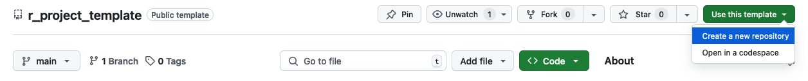

<!--

-->


# Code standards and templates


This repository outlines best practices for writing reproducible code and structuring project directories.

Templates include:
- [r_module.R](https://github.com/bgcasey/code_standards/blob/main/templates/r_module.R): A template for writing individual R modules.
- [r_function.R](https://github.com/bgcasey/code_standards/blob/main/templates/r_function.R): A template for writing well-documented and formatted R functions.
- [javascript_module.js](https://github.com/bgcasey/code_standards/blob/main/templates/javascript_module.js): A template for writing individual JavaScript modules.
- [javascript_function.js](https://github.com/bgcasey/code_standards/blob/main/templates/javascript_function.js): A template for writing well-documented and formatted JavaScript functions.
- [python_module.js](https://github.com/bgcasey/code_standards/blob/main/templates/python_module.py): A template for writing individual Python modules.
- [python_function.js](https://github.com/bgcasey/code_standards/blob/main/templates/python_function.py): A template for writing well-documented and formatted Python functions.
- [r_project_template](https://github.com/bgcasey/r_project_template): An R project template that provides a structured directory for organizing data, scripts, outputs, and documentation.  

The goal of this repository is to provide standards that improve collaboration, streamline code reviews, and make it easier to revisit past work.

**Why use these standards?**
1. **Sharing work with colleagues**:
    - Standardized templates and code conventions ensure that collaborators can easily understand, run, and build upon your work.
2. **In-house review of your work**:
    - A well-organized, reproducible codebase makes internal reviews easier. Team members or supervisors can quickly grasp your methods and results by examining the code, making it easier to identify and troubleshoot any issues.
3. **Sharing work with your future self**:
    - Revisiting old projects is easier when everything is well-documented and logically structured. This reduces the learning curve when returning to a project after time away.

While the examples provided are focused on R, the basic principles apply to any coding language. Clear documentation, structured file organization, and consistent coding styles enhances reproducibility and collaboration across different programming environments.

---

## Table of Contents
- [1. Code Style](#1-code-style)
- [2. Documenting Code](#2-documenting-code)
- [3. Documenting Functions](#3-documenting-functions)
- [4. Project Directory Structure](#4-project-directory-structure)
- [5. ABMI GitHub Policy](#5-abmi-github-policy)
---
## 1. Code Style

Style R code according to the conventions outlined in the [tidyverse style guide](https://style.tidyverse.org/index.html).  Google's [R style guide](https://google.github.io/styleguide/Rguide.html) is based in this. While you are encouraged to familiarize yourself with the tidyverse guide, here are some highlights:

### Filenames

Give your files meaningful names and avoid special characters. Use a consistent naming convention:

- **snake_case**:
    - Words are separated by underscores (`_`).
    - Letters are lowercase.
    - Example: `1_your_code_name.R`.
- **kebab-case**:
    - Words are separated by hyphens (`-`).
    - Letters are lowercase.
    - Example: `1-your-code-name.R`.
- **camelCase**:
    - The first word is lowercase, and subsequent words start with a capital letter.
    - No spaces or special characters between words.
    - Example: `1YourCodeName.R`.

Prefix files with numbers to show the order that files should be run:

```
00_process_response_data.R
01_process_predictor_data.R
...
09_generalized_linear_mixed_models.R
10_visualize_results.R
```

### Object names

Object names within the code should be concise, descriptive, and follow a consistent naming convention:

```R
bird_data <- read.csv("bird_species_data.csv")
pred_var <- read.csv("predictor_variables.csv")
```


### Code Syntax

- Add spaces after commas
- Place a space after `()` in functions. 
- `{{ }}` should have inner spaces
- Surround operators (`==`, `+`, `-`, `<-`, etc.) with spaces.
- For curly brackets `{}`, end lines with `{` and start lines with `}`
- Use `<-` to assign object names.
- Limit the line width of your code to 80 characters for readability. This will ensure that the code can be printed or displayed without cropping. 
- Comment your code to explain its purpose, inputs, outputs, and rationale. Comments should begin with # followed by a space.
- 
### Auto-styling

R code can be automatically formatted according to the [tidyverse style guide](https://style.tidyverse.org/index.html) using the `styler` R package:

```r
library(styler)
styler::style_file("file/path/file.R", style = tidyverse_style)
```

See the `styler` [documentation](https://styler.r-lib.org/) for instructions on how to integrate `styler` into the RStudio GUI. 

---
## 2. Documenting Code

Proper documentation is crucial for ensuring code reproducibility. It allows colleagues and reviewers to fully understand your rationale, methods, and outputs. While there are many ways to document code, here are some recomendations:

### Code header
Scripts should start with a header that includes the following components:

| **Component** | **Description**                                                                                                    |
| ------------- | ------------------------------------------------------------------------------------------------------------------ |
| **Title**     | A brief and descriptive name for the script that summarizes its purpose.                                           |
| **Author**    | The name of the person or team responsible for writing the code.                                                   |
| **Date**      | The creation or last modification date of the code, formatted as YYYY-MM-DD for consistency.                       |
| **Inputs**    | A list of the input data, files, or parameters required for the script to run, including file paths or formats.    |
| **Outputs**   | A description of the output produced by the script, including file names, formats, and what the results represent. |
| **Notes**     | A concise explanation of what the code does, its purpose, and any important details about its function. You can also use this section to list proposed improvements for the code for future iterations.            |


**Example header in YAML-like format:**

```R
# ---
# title: "Title"
# author: "Your Name"
# created: "YYYY-MM-DD"
# inputs: [list the required input files]
# outputs: [list the output files produced by the script]
# notes: 
#   "This script performs [describe the main purpose of the script].
#   The script uses [briefly describe data or object inputs] to 
#   [briefly describe the main steps or processes]. The script
#   produces [describe the final output]."
# ---

```

## Code body

The body of your script should be divided into clear, well-labeled, numbered sections for easy navigation:

### Setup

Start with a setup section. This section will usually include the following subsections:

- **Load packages**: List all the required R packages, each accompanied by a comment explaining their use and package version.

```R
## 1.1 Load packages ----
library(tidyverse)   # data manipulation and visualization (version: 1.3.1)
library(lubridate)   # date-time manipulation (version: 1.7.10)
```

- **Import data**: Describe the data and objects that are being loaded.

```R
## 1.2 Import data ----
# Description of data
# data <- read.csv("path/to/your/data.csv")
```

### Section headings

Each subsequent section of the script should include a descriptibve numbered heading. Beneath the heading, include a comment describing the section's purpose. This makes it easier for others to understand the logical flow of the script. For example:

```R
# 2. Data Cleaning ---- 
# This section handles the preprocessing and cleaning of the input 
# data. It removes missing values, filters unnecessary rows, and 
# transforms variables.
```

Subdivide sections as needed with descriptive numbered subheadings:

```R
## 2.1 Filter data ----
# This step filters the data to keep only relevant observations.
filtered_data <- data %>% filter(variable == "value")
```
Use four trailing dashes (-), equal signs (=), or hashtags (#) at the end of your headings to 
create discrete sections that are foldable and navigable within RStudio's  **Jump To** menu at the bottom of the editor.

### Create new R files using a template

You can create new R files based on the [r_module.R](https://github.com/bgcasey/code_standards/blob/main/templates/r_module.R) template by adding a function to your .Rprofile file. 

1. Run the following command in your R console to open the global .Rprofile for editing:

```R
file.edit("~/.Rprofile")
```

2. Add the following function and save:

```R
#' Create a New R Module Based on a GitHub Template
#'
#' This function creates a new R script using a template stored on 
#' GitHub. The template is downloaded directly from the provided 
#' URL, ensuring the latest version is used.
#'
#' @param filename Character. The name of the new R script file to 
#' be created. Defaults to "new_script.R".
#' @return Opens the newly created R script in the editor.
#' 
#' @example 
#' # Example usage of the function
#' new_r_module("my_new_script.R")
#' # This will create a new R script named "my_new_script.R" using 
#' # the GitHub template.
#' 
new_r_module <- function(filename = "new_script.R") {
  # Step 1: Define the GitHub URL for the template
  github_template_url <- "https://raw.githubusercontent.com/bgcasey/code_standards/main/templates/r_module.R"
  
  # Step 2: Download the template from GitHub to a temporary file
  temp_template <- tempfile(fileext = ".R")
  tryCatch(
    {
      download.file(github_template_url, temp_template, quiet = TRUE)
      message("Template downloaded successfully!")
    },
    error = function(e) {
      stop("Failed to download template: ", e$message)
    }
  )
  
  # Step 3: Copy the template to the specified filename
  tryCatch(
    {
      file.copy(temp_template, filename, overwrite = TRUE)
      message("New R module created: ", filename)
      
      # Step 4: Open the new file in the editor
      file.edit(filename)
    },
    error = function(e) {
      stop("Failed to create the new R module: ", e$message)
    }
  )
  
  # Step 5: Return a success message
  return(invisible(filename))
}
```

3. Restart R. 

4. Now you can use the function to create new R files.

```R
new_r_module("my_new_script.R")
```

This will create a new R script named "my_new_script.R" using the [r_module.R](https://github.com/bgcasey/code_standards/blob/main/templates/r_module.R) template. 


---

## 3. Documenting Functions

Functions should be well-documented to ensure they are understandable and easy to use. See [Roxygen2](https://roxygen2.r-lib.org/) for more information on function style conventions.

### Function Header

Each function should have a header that describes the function's purpose, its inputs (parameters), and the expected output:

| **Component**   | **Description**                                                                                                                                                              |
| --------------- | ---------------------------------------------------------------------------------------------------------------------------------------------------------------------------- |
| **Title**       | A brief, descriptive title of the function that summarizes its purpose.                                                                                                      |
| **Description** | A short explanation of what the function does, including the primary task or transformation it performs.                                                                     |
| **@param**      | A description of each parameter (argument) the function accepts. It should include the parameter name, its type, and what it represents or does.                             |
| **@return**     | A description of what the function returns, specifying the type of the returned object and what information or result it holds.                                              |
| **@example**    | A reproducible example showing how to use the function, including input data, the function call, and expected output. This helps users understand how to apply the function. |

### Function body

The function body contains the code that implements the function. Each major step in the code should include a numbered comment explaining its purpose. This helps users understand the function and makes debugging easier.

**Recommended structure for a function:**

```R
#' [Title of the Function]
#'
#' [Brief description of what the function does]
#'
#' @param [param_name] [Type and description of the parameter]
#' @param [param_name] [Type and description of the parameter]
#' @param [param_name] [Type and description of the parameter]
#' @return [Description of the return value or object]
#' 
#' @example # Example usage of the function
#' [Example data]
#' [Example function call]
#' [Example result printing]
[function_name] <- function([param1], [param2], 
                            [param3] = [default_value], 
                            [param4]) {
  # [Step 1: Description of what this step does]
  [code for step 1]
  
  # [Step 2: Description of what this step does]
  [code for step 2]
  
  # [Step 3: Description of what this step does]
  [code for step 3]
  
  # [Step 4: Description of what this step does]
  [code for step 4]
  
  # [Step 5: Description of what this step does]
  [code for step 5]
  
  return([result])
}
```

---
## 4. Project Directory Structure

Data, code, and output files should be organized within a well-structured directory. For example:

| **Item**                 | **Description**                                   |
| ------------------------ | ------------------------------------------------- |
| **0_data/**              | Raw and manipulated data  [^1]                   |
| ├── external/            | Raw data from external sources                   |
| ├── processed/           | Data that has been manipulated                  |
| **1_code/**              | Code and scripts for analysis                    |
| ├── GEE/                 | Google Earth Engine scripts                      |
| │   └── gee_git_clone.sh | Script to clone GEE repository                   |
| ├── r_scripts/           | R scripts for data processing                    |
| │   └── r_module.R       | Template R script                                |
| │   └── r_function.R     | Template R function                              |
| **2_pipeline/**          | Temporary pipeline files [^1]                    |
| **3_output/**            | Final project output files                              |
| ├── data/                | Processed datasets                               |
| ├── figures/             | Generated figures                                |
| ├── maps/                | Generated maps                                   |
| ├── models/              | Model outputs                                    |
| └── tables/              | Tables from analysis                             |
| **4_writing/**           | Manuscript and reports                           |
| ├── manuscript/          | Drafts of the manuscript                         |
| └── reports/             | Reports and additional documents                 |
| **5_presentations/**     | Presentation materials                           |
| ├── slides/              | Presentation slides (e.g., .pptx)                |
| └── posters/             | Conference posters                               |
| **6_bookdown/**          | Bookdown documentation and project vignette      |
| ├── index.Rmd            | Main Bookdown file (project vignette)           |
| ├── _bookdown.yml        | Bookdown configuration                           |
| └── (additional .Rmd)    | Chapters/sections of the Bookdown documentation  |
| **README.md**            | Project overview and instructions                |


Below is an overview of the main folders in a project directory:

### 0_data
This folder holds all **raw and manipulated data** used in the project.

- **external/**  
  - **Purpose**: Stores the original, unprocessed (“raw”) data from external sources (e.g., CSV files, shapefiles, remote sensing data).  
  - **Typical contents**: Files downloaded from a public repository, database exports, or any data provided by collaborators.   
  - *Tip*: Keep these files in their original form for reproducibility and to avoid accidental overwriting.

- **processed/**  
  - **Purpose**: Contains “analysis-ready” data—data that have been cleaned, transformed, or pre-processed.  
  - **Typical contents**: CSV, RData, shapefiles, etc. that are ready for direct use by scripts in `1_code/`.
  - *Tip*: Think of this as your “staging ground” for cleaned data that can be loaded quickly by your analysis scripts.

### 1_code

- **Purpose**: This folder holds **all code and scripts** for your project—from data cleaning to final analyses.
- **Typical contents**: R, JavaScript, Python files organized and named according to their step in the project workflow.
*Note*: Consider adding subfolders for other languages or script types (e.g., `python_scripts/`, `bash_scripts/`) if needed.

### 2_pipeline

- **Purpose**:  
  - Houses **intermediate files** that are not final deliverables but useful for re-running code or debugging. 
- **Typical contents**: checkpoints, logs, temporary files, and partial outputs (e.g., data subsets during model training) to avoid re-generating heavy files from scratch.

*Tip*: Keeping intermediate files here means you don’t clutter the `0_data` or `3_output` folders with temporary files. 

### 3_output
Collects the **final (or “permanent”) outputs** of your analyses—whatever you plan to archive, publish, or share broadly. 

- **Purpose**:Stores complete and polished outputs: cleaned datasets, figures, tables, model results, etc.
- **Typical contents**:
  - **data/**: Final data products that might be shared or referenced in publications.
  - **figures/**: High-quality plots and visualizations for reports, papers, or presentations.
  - **maps/**: Geographic products (e.g., shapefiles, GIS layers, static map images).
  - **models/**: Final model objects, predictions, or performance metrics.
  - **tables/**: Summaries or statistical tables ready for publication.

- *Tip*: If you were to share your project’s key results, you’d pull them from here.
  
### 4_writing
Contains all **written materials**—manuscripts, reports, and supporting documents.

- **manuscript/**  
  - **Purpose**: Drafts of the main publication or paper.
  - **Typical contents**: Word docs, LaTeX files, references

- **reports/**  
  - **Purpose**: Additional documents outside the primary manuscript (e.g., progress reports, technical docs, stakeholder summaries).
  - **Typical contents**: PDF or Word documents that serve as “formal communication” to collaborators or funding agencies.

### 5_presentations
- **Purpose**: Stores **presentation materials** used to communicate your project’s work.
- **Typical contents**: Slide decks, speaker notes, conference posters.

### 6_bookdown 

- **Purpose**: Contains **Bookdown documents**. A dedicated space for creating Bookdown-based documentation, tutorials, or a detailed project vignette. 

- **Typical contents**:
    - `_bookdown.yml` and `index.Rmd` 
    - Chapter .Rmd files: Individual sections of your Bookdown document (e.g., introduction, methodology, results). 
    - A compiled "book" (e.g. PDF or HTML)
 
### README.md
The **“front door”** to your project—an overview and instructions for replication.

  - Explains the project’s goals, scope, and context.  
  - Details how to set up the environment (required libraries, data sources, program languages).  
  - Guides others (and your future self) on how to run the project steps or locate key files.

### Putting It All Together

- **0_data**: Raw (`external/`) and analysis-ready (`processed/`) data.  
- **1_code**: Your “toolshed” of scripts in R, Python, GEE, etc.  
- **2_pipeline**: Intermediate files—logs, partial files, checkpoints, etc.
- **3_output**: Final, polished deliverables—data, figures, tables, models.  
- **4_writing**: Manuscripts, reports, and other written documentation.  
- **5_presentations**: Slides, posters, and other public-facing materials.  
- **6_bookdown**: Bookdown documentation for project vignettes, user guides, or tutorials.
- **README.md**: The roadmap for anyone navigating or replicating the project.

### Use a Template to Create a New Repository

A template repository can be found [here](https://github.com/bgcasey/r_project_template). It can be used to generate new GitHub repositories with the above directory structure. 
While the template is designed for R projects, projects in other programming environments should maintain a similar directory structure. 

To create a new repository from the template:

1. Navigate to the **main page** of the [template repository](https://github.com/bgcasey/r_project_template) in your browser.
2. Look for the **“Use this template”** button (usually located on the top right side of top GitHub UI bar. 
3. Click **“Use this template”** to open a drop-down menu. Click **"Create a new repository"** and follow the instructions.

Below is a screenshot showing where to click **“Use this template”** on GitHub:




---

## 5. ABMI GitHub Policy

GitHub (and Git) are powerful tools for facilitating reproducible code repositories. This will allow the ABMI to better showcase the technical work that goes into developing the variety of data products we provide. The purpose of the ABMI GitHub Policy is to provide general information to new users and outline a standard policy for what information is made available. The following document outlines:

1. Member privileges to the organizational GitHub account.  
2. Repository naming conventions.  
3. Repository Visibility  
4. Topic tags

### Member privileges

The Director(s) of the Science Centre are **Owners** of the organizational Github account ([https://github.com/ABbiodiversity](https://github.com/ABbiodiversity)). In addition, the Director(s) can declare a subset of users as **Owners** to manage day to day operations of the account. 

All ABMI staff who use GitHub are able to become a **Member** of the ABMI organizational account ([https://github.com/ABbiodiversity](https://github.com/ABbiodiversity)).  Members are strongly encouraged to make their membership status of the organization public. In addition, anyone outside of ABMI staff that is supporting ABMI work can be added as an **Outside Collaborator** upon approval of the *Current Owners* (Schedule 1).

### Repository Visibility

All repositories that are used as part of work for the ABMI should always be **Private.** This allows for users to develop the repository and all content within it before an official release. The repository should then be made **Public** if it meets to following conditions:

1) Does not contain any sensitive information (e.g., site location, proprietary data products).  
2) Coincides with or after the release of the associated data product.

Repositories can be maintained as **Private** if they relate to code that is used for internal processes (e.g., data cleaning).

Users are free to initially make these **Private** repositories under their personal GitHub accounts. However, all repositories should be transferred to the ABMI organizational account under the following circumstances:

1) Public release of the data product.  
2) Private release of a completed data product used for internal purposes.  
3) Employee no longer works for the ABMI.

Repositories should be **Archived** as read-only (but can remain public) if active development has ceased and is unlikely to occur again in the future. 

We encourage all GitHub users to make their repositories **Public** whenever possible as it showcases both their work, and the work of the ABMI to stakeholders.

#### Releases

Whenever work on a repository has been completed, a **Release** tag should be added. These releases should be versioned using a three digit format that corresponds to major (changes that break functionality), minor (backwards compatible changes), and patches (bug fixes, typos; e.g., v1.0.2).

### Repository naming conventions

In general, repositories should be named using the **Camel Case** format (e.g., StreamConnectivity, BirdModels, etc..). The format within each repository is flexible, but we recommend trying to implement a standardized folder structure when possible. 

Example of the [folder structure](#4-project-directory-structure) being adopted by the Science Centre.

### Topics 
Topics are a way for users to add “tags” to their repositories. This allows similar repositories to be grouped together to assist accessibility through search. These tags are under development, but we recommend users implement some of the following tags when possible:

- *documentation* \- used to identify if the repository is used as technical documentation of an analysis or workflow.  
- *internal-tool* \- used to identify any repository that is used only for internal workflows.  
- *species-distribution-models* \- used to identify repositories associated with the ABMI species models.  
- *project* \- to differentiate between one off projects and those that will be continually updated.  
- *r-package* \- used to indicate the repository contains an R package with associated functions. 

### Github Pages
GitHub Pages are a great resource for creating static HTML pages that can be shared ([https://abbiodiversity.github.io/AmphibianModels/](https://abbiodiversity.github.io/AmphibianModels/)). The *Bookdown* format is great for creating technical documents and is fairly easy to create and maintain. Each centre within the ABMI has methods for developing technical documentation, so this is not a requirement for GitHub users.

### Questions
If you have any questions about your repositories, please contact [Brandon Allen](mailto:brandon.allen@ualberta.ca), [Brendan Casey](mailto:brendan.casey@ualberta.ca), or [Marcus Becker](mailto:mabecker@ualberta.ca).

---

[^1]: Data and pipeline files are generally added to `.gitignore` to prevent them from being pushed to GitHub.


